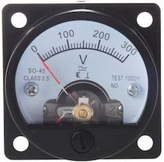

# YAPMC: Yet Another Panel Meter Clock
Using panel meters, driven by an Arduino or compatible, to tell time without an RTC, using SO-45, Class 2.5, panel meters easily found on "teh bays."

Meter        | Case
------------ | -------------
 | 
          
## Basics
The idea of this project is to develop a clock which gives the illusion of being analog, despite being very digital inside. Even the drift resulting from not having a real time clock module is a deliberate choice. Using two SO-45 panel meters to display Hours and Minutes via PWM output on an ESP8266 (D1 mini, particularly), or any other class of microcontroller, gives an easy-to-read, general time, accurate to the minute.

With the addition of an AM/PM light, LED backlighting within the meters and 2 buttons, for setting hours and minutes respectively, the clock is as familiar to operate as any retro bedside clock from the 70s or 80s. Time is counted in configurable ticks (100ms default) and the millis() reset is tested for and skipped. Any small amount of drift can be corrected with the minutes and hours setting buttons.

Future features will include option LDR sensing of ambient light via the analogue input. A flashing seconds light is also optional.

This is still very much a work in progress and there may be traps and errors in the code. However, do feel free to join the project. We're better in community than alone :D

The time engine is loosely based on code by Ruben Marc Speybrouck from "Timekeeping on ESP8266 & Arduino Uno WITHOUT an RTC (Real Time CLock)?" over at https://www.instructables.com/id/TESTED-Timekeeping-on-ESP8266-Arduino-Uno-WITHOUT-/ However, I've made some significant changes, such as adding the "ticks" functionality to reduce the impact of the millis() rollover to less than a second per rollover and, of course, replacing the terminal output with panel meters. (The terminal display is left in to assist with debugging, I recommend disabling it when you're ready for a production build.)
 
This project is creative commons licenced and my be used for any purpose provided full attribution, share-alike terms are met.

## Scope
* __ESP8266__ in form of D1 mini, powered by generic USB wall plug. Any Arduino or compatible should be usable in this project with little or no modification to the code, other than pin definitions in pins.h. Of course, your mileage may vary.
* __Hours and minutes display__ via PWM on a pair of panel meters, driven via PWM on pins D6 (minutes) and D7 (hours)
* __Seconds and AM/PM marked by an LED__ on pin D5 (seconds, optional, off for odd value, on for even value) and D8 (AM/PM)
* __Minutes and hours advance via momentary pushbuttons__ (or two-way momentary switch) connected to pins D3 (minutes) and D4 (hours)
* __Meter backlights__ may simply be hardwired (on all the time) or, via pins D1 and D2, brightness managed via an LDR on A0, as well as potentially dimming the backlight significantly after 10PM via PWM.
## Future Development
* __An alarm function__ could be added by using D0 as a setMode button and sacrificing flashing seconds on D5 to be used to send a tone to a buzzer instead. This may be added to a later version, but is not immediately supported in this version. There are insufficient pins on the D1 mini to have flashing seconds as well as an alarm function, but other boards, such as a NodeMCU ESP8266, typical ESP32 boards and most Arduini, will have sufficient pins to have a full feature set.
* __Configuation by internal wireless AP and web server__ including configuration of connection to home wifi.
* __NTP time management__ configurable in above web-based configuration feature.
