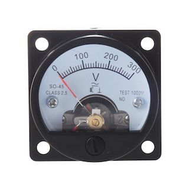
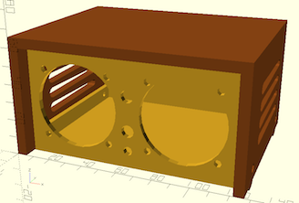

# YAPMC: Yet Another Panel Meter Clock
Using panel meters, driven by an Arduino or compatible, to tell time without an RTC, using SO-45, Class 2.5, panel meters easily found on "teh bays."

Meter        | Case
------------ | -------------
 | 
          
## Basics
The idea of this project is to develop a clock which gives the illusion of being analog, despite being very digital inside. Even the drift resulting from not having a real time clock module is a deliberate choice. Using two SO-45 panel meters to display Hours and Minutes via PWM output on an ESP8266 (D1 mini, particularly), or any other class of microcontroller, gives an easy-to-read, general time, accurate to the minute.

With the addition of an AM/PM light, LED backlighting within the meters and 2 buttons, for setting hours and minutes respectively, the clock is as familiar to operate as any retro bedside clock from the 70s or 80s. Time is counted in configurable ticks (100ms default) and the millis() reset is tested for and skipped. Any small amount of drift can be corrected with the minutes and hours setting buttons.

Future features will include option LDR sensing of ambient light via the analogue input. A flashing seconds light is also optional.
 
This project is creative commons licenced and my be used provided full attribution, share-alike terms are met.

## Scope

(more to come)
